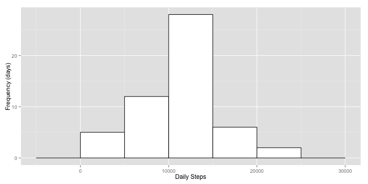
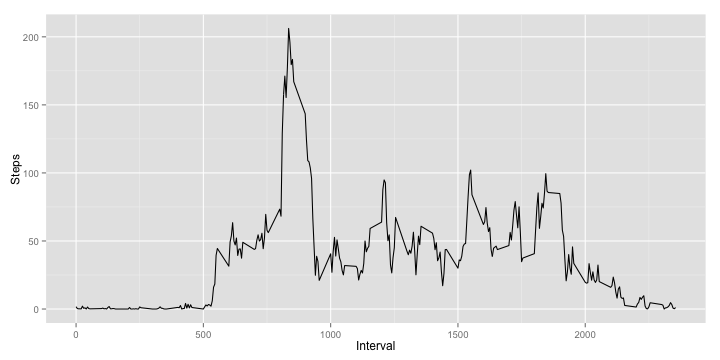
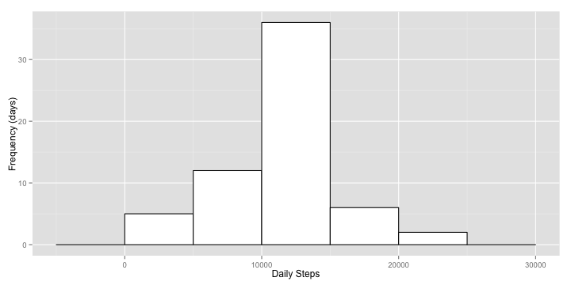
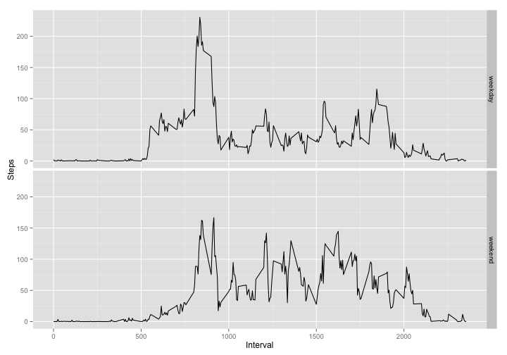

# Reproducible Research: Peer Assessment 1 


## Loading and preprocessing the data


```r
data <- unz("activity.zip", "activity.csv")     # unzip file
data <- read.csv(data)                          # load data
data$date <- as.Date(data$date)                 # convert column to Date type
```


## What is mean total number of steps taken per day?

Calculate and report the mean and median total number of steps taken per day (ignore missing values)


```r
steps_sum <- aggregate(steps ~ date, FUN = sum, data)
steps_mean <- mean(steps_sum$steps, na.rm = TRUE)
steps_median <- median(steps_sum$steps, na.rm = TRUE)
```


```r
steps_mean
```

```
## [1] 10766
```

```r
steps_median
```

```
## [1] 10765
```

Make a histogram of the total number of steps taken each day


```r
ggplot(steps_sum, aes(x=steps)) + geom_histogram(binwidth=5000, color='black',fill='white') + labs(x='# of Steps taken', y='# of Days (53 total days)')
```

 


## What is the average daily activity pattern?

Make a time series plot (i.e. type = "l") of the 5-minute interval (x-axis) and the average number of steps taken, averaged across all days (y-axis)


```r
steps_interval <- aggregate(steps ~ interval, FUN = mean, data)
ggplot(data = steps_interval, aes(x=interval, y=steps, group=1)) + geom_line() + labs(x='Interval', y='# of Steps taken')
```

 

Which 5-minute interval, on average across all the days in the dataset, contains the maximum number of steps?


```r
steps_interval[which.max(steps_interval$steps), ]$interval
```

```
## [1] 835
```


## Imputing missing values

Calculate and report the total number of missing values in the dataset (i.e. the total number of rows with NAs)


```r
sum(!complete.cases(data))
```

```
## [1] 2304
```

Devise a strategy for filling in all of the missing values in the dataset. The strategy does not need to be sophisticated. For example, you could use the mean/median for that day, or the mean for that 5-minute interval, etc.

Create a new dataset that is equal to the original dataset but with the missing data filled in.


```r
# Use mean values of the corresponding 5-minute intervals to impute missing values.
imputed_data <- data
for (i in 1:nrow(imputed_data)) {
    if (is.na(imputed_data$steps[i])) {
        index_imputed <- which(steps_interval$interval == imputed_data[i, ]$interval)
        imputed_data$steps[i] <- steps_interval[index_imputed, ]$steps
    }
}
```

Make a histogram of the total number of steps taken each day and Calculate and report the mean and median total number of steps taken per day.


```r
steps_sum_imputed <- aggregate(steps ~ date, FUN = sum, imputed_data)
steps_mean_imputed <- mean(steps_sum_imputed$steps, na.rm = TRUE)
steps_median_imputed <- median(steps_sum_imputed$steps, na.rm = TRUE)
```


```r
ggplot(steps_sum_imputed, aes(x=steps)) + geom_histogram(binwidth=5000, color='black',fill='white') + labs(x='# of Steps taken', y='# of Days (53 total days)')
```

 


```r
steps_mean_imputed
```

```
## [1] 10766
```

```r
steps_median_imputed
```

```
## [1] 10766
```

Do these values differ from the estimates from the first part of the assignment? What is the impact of imputing missing data on the estimates of the total daily number of steps?

- Imputing based on the mean value of corresponding 5-minute interval caused the **frequency of days** to **increase** for daily steps ranging from 10,000 - 15,000.
- The **mean** value **did not change** after the imputed values were added. 
- The **median** had an **insignificant increase** after the imputed values were added.

## Are there differences in activity patterns between weekdays and weekends?

Create a new factor variable in the dataset with two levels -- "weekday" and "weekend" indicating whether a given date is a weekday or weekend day.


```r
imputed_data$day <- "weekday"                                   # assume all days are weekdays
weekend = c("Saturday", "Sunday")                               # define vector of weekend days
for (i in 1:nrow(imputed_data)) {
        if (weekdays(imputed_data[i, ]$date) %in% weekend) {    # if day in `weekend days` vector,
            imputed_data[i, ]$day <- "weekend"                  # set day to "weekend"
        }
}
```

Make a panel plot containing a time series plot (i.e. type = "l") of the 5-minute interval (x-axis) and the average number of steps taken, averaged across all weekday days or weekend days (y-axis). 


```r
library(lattice)
steps_interval_day <- aggregate(steps ~ interval + day, imputed_data, mean)
xyplot(steps ~ interval | day, data = steps_interval_day, layout = c(1, 2), type = "l")
```

 
